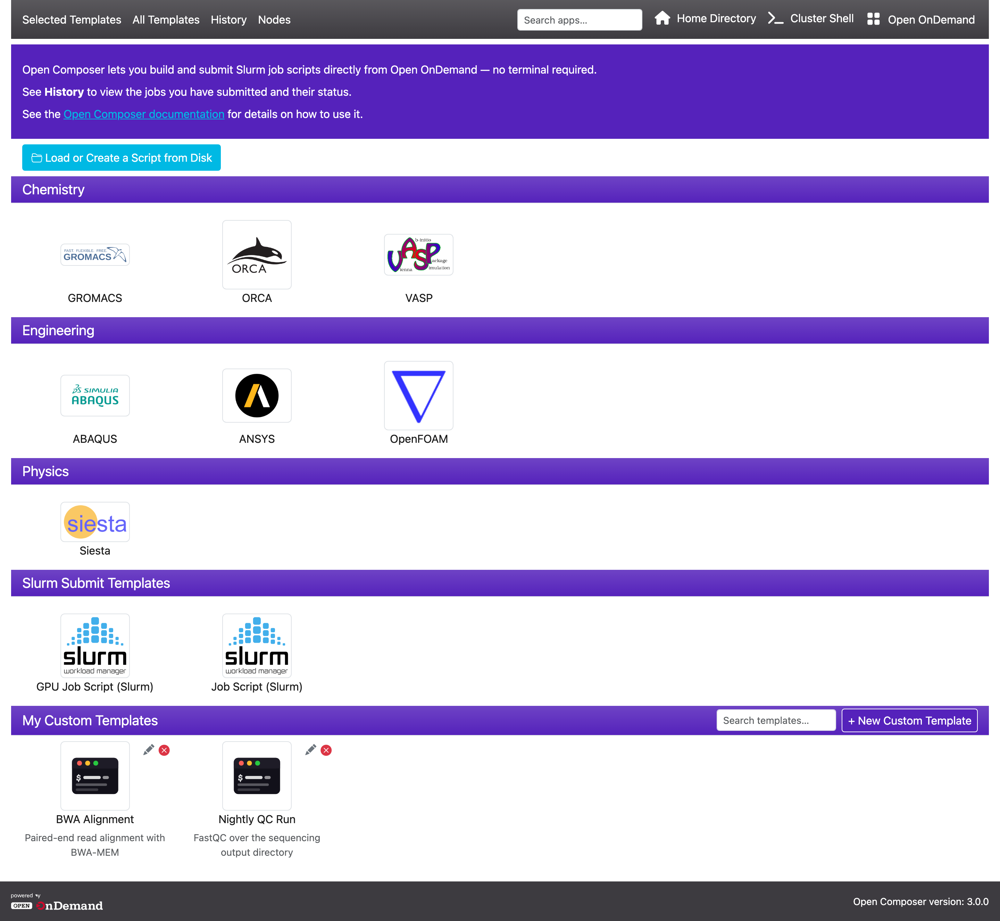
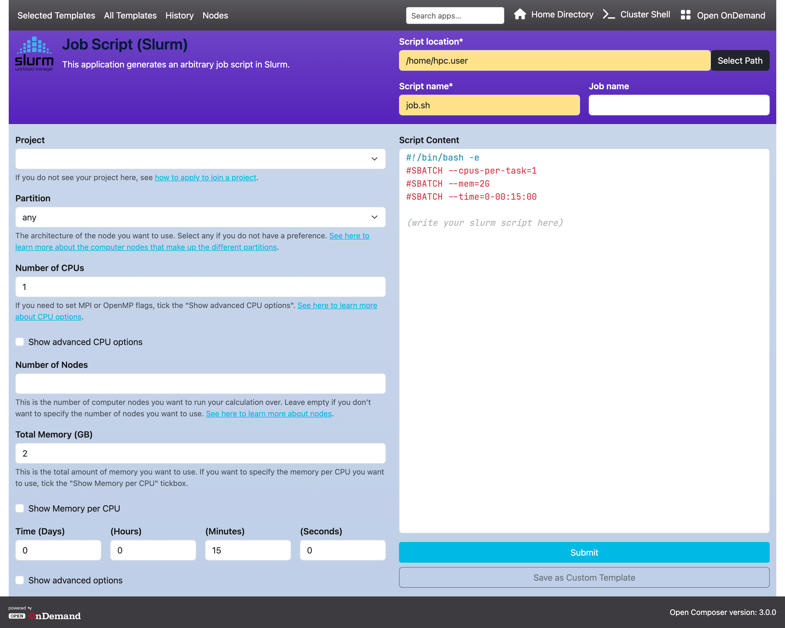
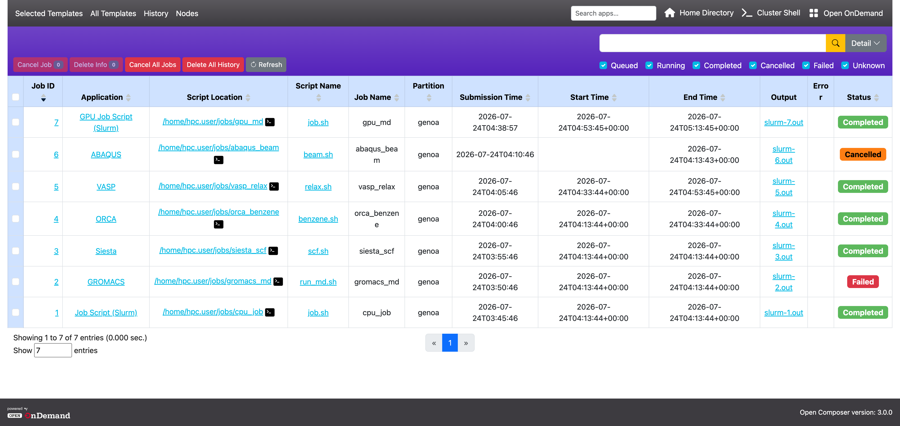
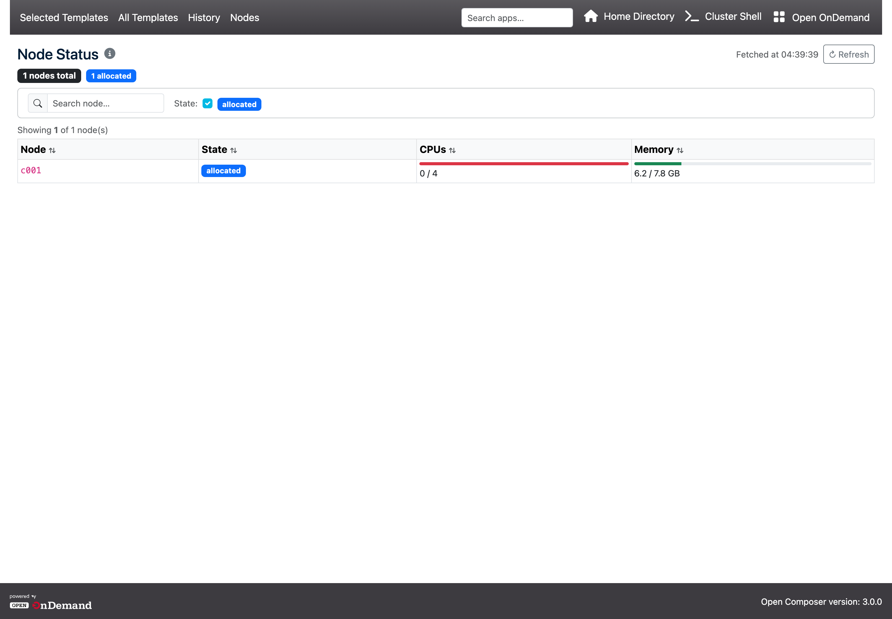

# Open Composer

## Overview

Open Composer is a web application to generate batch job scripts and submit batch jobs for HPC clusters on [Open OnDemand](https://openondemand.org/).

Open Composer is an Open OnDemand app in the "Jobs" category. Unlike Batch Connect interactive apps, Open Composer provides a graphical interface for creating, previewing, editing, and submitting batch job scripts. It supports multiple job schedulers and can be configured for different HPC applications.

- **App type:** Workflow Composer (Jobs category)
- **Latest release:** [`v3.0.0`](https://github.com/RIKEN-RCCS/OpenComposer/releases/tag/v3.0.0) (see [Changelog](CHANGELOG.md))
- **License:** MIT (see [LICENSE file](https://github.com/RIKEN-RCCS/OpenComposer/blob/main/LICENSE))
- **Requirements:** Open OnDemand 3.0 or later
- **Supported job schedulers:** Slurm, PBS Pro, PBS Pro/Miyabi, Grid Engine, Fujitsu TCS

## Features

- Graphical web interface for generating and submitting batch job scripts
- Multi-scheduler and multi-cluster support
- Job history page with filtering, status tracking, and job cancellation
- One-by-one job cancellation with an animated in-modal progress bar
- Job history driven by the scheduler itself, so jobs submitted outside Open Composer are listed too
- Optional Job Efficiency report (wall time, CPU, memory, GPU) for finished jobs
- Editable job script preview before submission, with two-way sync between the script and the form
- Configurable application forms via `form.yml`
- Dynamic form widgets with conditional visibility and validation
- Environment-module widgets, including a dropdown that follows another widget's value
- Support for preprocessing steps via submit sections
- Customizable per-application headers and labels
- Path selector widget for file and directory selection
- My Templates — save, manage, reorder, and reuse form configurations
- All Templates page listing every template, including apps hidden from the home page
- "Load or Create a Script from Disk" file browser for editing and resubmitting existing scripts
- Nodes page with dynamic GRES columns auto-discovered from the scheduler
- Navbar search bar for quickly finding templates by name, category, or description
- Optional automatic SSH key provisioning so SSH-based submission needs no password prompt
- Optional OOD-embedded mode — renders inside Open OnDemand's own navbar and footer
- Fully customisable navbar and footer (colours, logo, links)
- Bilingual documentation (English and Japanese)

## Deployment

By default, Open Composer opens in its own tab/window when a user clicks the app tile. This is the standard OOD app behaviour and requires no extra configuration beyond installing the app itself. Alternatively it can run in **OOD-embedded mode**, rendered inside OOD's own navigation bar and footer — see [`ood_integration/`](ood_integration/) and [section 4 of the installation document](https://riken-rccs.github.io/OpenComposer/docs/install.html#ood-integration).

Use `conf.yml.erb.sample` as your starting point — it lists every available setting with its default value:

```sh
cd /var/www/ood/apps/sys/
sudo git clone https://github.com/RIKEN-RCCS/OpenComposer.git opencomposer
cd opencomposer
sudo cp conf.yml.erb.sample conf.yml.erb
# Edit conf.yml.erb for your site
```

The full navbar is shown by default: the **Selected Templates**, **All Templates**, **History** and **Nodes** links on the left, and the search box, Home Directory link, Shell Access link and Return-to-OnDemand button on the right. Each right-hand item can be hidden (`show_search`, `show_home_directory`, `show_shell_access`, `show_open_ondemand`) and relabelled. A navbar logo appears only once you set `navbar_logo` to an image in `public/`.

## Screenshots

### Home page



### Application page



### History page



### Nodes page



## Documents

Full documentation (installation, application settings, user manual):

<table>
  <tr>
    <td>Installation for administrator</td>
    <td><a href="https://riken-rccs.github.io/OpenComposer/docs/install.html" target="_blank">EN</a></td>
    <td><a href="https://riken-rccs.github.io/OpenComposer/docs/install_ja.html" target="_blank">JA</a></td>
  </tr>
  <tr>
    <td>Application Settings for administrator</td>
    <td><a href="https://riken-rccs.github.io/OpenComposer/docs/application.html" target="_blank">EN</a></td>
    <td><a href="https://riken-rccs.github.io/OpenComposer/docs/application_ja.html" target="_blank">JA</a></td>
  </tr>
  <tr>
    <td>User Manual</td>
    <td><a href="https://riken-rccs.github.io/OpenComposer/docs/manual.html" target="_blank">EN</a></td>
    <td><a href="https://riken-rccs.github.io/OpenComposer/docs/manual_ja.html" target="_blank">JA</a></td>
  </tr>
</table>

## Quick Start

### Standalone app

The following steps assume administrator privileges. If you do not have administrator privileges, see [Section 4. "Installation by general user"](https://riken-rccs.github.io/OpenComposer/docs/install.html#general) in the installation document.

```sh
cd /var/www/ood/apps/sys/
sudo git clone https://github.com/RIKEN-RCCS/OpenComposer.git opencomposer
cd opencomposer
sudo cp conf.yml.erb.sample conf.yml.erb
# Edit conf.yml.erb for your site
```

At minimum, set `apps_dir` and either `scheduler` or a `clusters` block. Every other setting in `conf.yml.erb.sample` is listed with its default value and can be left as-is.

Then reload the OOD dashboard (**Help → Restart Web Server**). Open Composer will appear in the **Jobs** category.

## Testing

| System      | Site       | Scheduler          | Repository                                                               |
|-------------|------------|--------------------|--------------------------------------------------------------------------|
| Fugaku      | RIKEN RCCS | Fujitsu TCS, Slurm | [composer_fugaku](https://github.com/RIKEN-RCCS/composer_fugaku)         |
| R-CCS Cloud | RIKEN RCCS | Slurm              | [composer_rccs_cloud](https://github.com/RIKEN-RCCS/composer_rccs_cloud) |

## Contributing

For discussions, see the [GitHub Discussions](https://github.com/RIKEN-RCCS/OpenComposer/discussions).

## Troubleshooting

Open Composer writes one line per significant action — `Submit job`, `Cancel job`, `Delete job information`, `Ensure SSH key`, and `Run commands in the check/submit section` — to the per-user PUN log, normally `/var/log/ondemand-nginx/$USER/error.log`. Each line is prefixed `[Open Composer]` and records the scheduler, cluster, and job IDs involved, which makes it the best starting point for a failed submission.

For bugs or feature requests, [open an issue](https://github.com/RIKEN-RCCS/OpenComposer/issues) with the relevant `[Open Composer]` log lines and reproduction steps.

## Reference

If you use this software in your research or development work, please cite the following publication:

> Masahiro Nakao and Keiji Yamamoto. 2025. "Open Composer: A Web-Based Application for Generating and Managing Batch Jobs on HPC Clusters". In Proceedings of the SC '25 Workshops of the International Conference for High Performance Computing, Networking, Storage and Analysis (SC Workshops '25). ACM, New York, NY, USA, 697-704. [https://doi.org/10.1145/3731599.3767428](https://doi.org/10.1145/3731599.3767428)

## Presentation

- [HUST: International Workshop on HPC User Support Tools](https://hust-workshop.github.io), St. Louis, USA, Nov. 2025 [[Paper](https://doi.org/10.1145/3731599.3767428)] [[Slide](https://www.mnakao.net/data/2025/HUST2025.pdf)]
- [SupercomputingAsia 2025](https://sca25.sc-asia.org/), Singapore, Mar. 2025 [[Poster](https://mnakao.net/data/2025/sca.pdf)]
- [The 197th HPC Research Symposium](https://www.ipsj.or.jp/kenkyukai/event/arc251hpc197.html), Fukuoka, Japan, Dec. 2024 [[Paper](https://mnakao.net/data/2024/HPC197.pdf)] [[Slide](https://mnakao.net/data/2024/HPC197-slide.pdf)] (Japanese)

## Known Limitations

- The environment-module widgets (`module_load`, `dependent_module_select`) and the automatic GPU badge require an external JSON module catalogue, configured with `modules_list_url`. With no catalogue configured they are simply inactive.
- Job Efficiency derives its GPU-memory percentage from a hard-coded table of GPU models; other accelerators show raw usage only.
- The `check` section is evaluated with Ruby, and the `submit` section with Bash; neither is sandboxed, so treat `form.yml` files as trusted code.

## Acknowledgments

The authors thank the Open OnDemand community for providing a robust ecosystem for HPC web applications.
Development of Open Composer has been carried out at [RIKEN R-CCS](https://www.r-ccs.riken.jp/en/), with significant contributions from [RIST](https://www.rist.or.jp/ehome.html).
